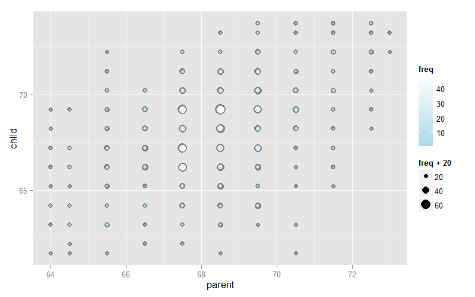
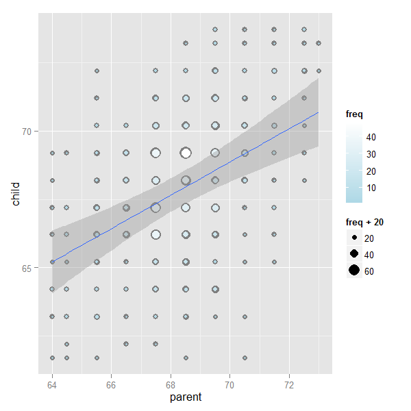

# Least Squares Estimation of Regression Lines


## General Least Squares for Linear Equations

Consider again the parent and child height data from Galton

<div class="rimage center"></div>

---

## Fitting the Best Line

- Let $Y_i$ be the $i^{th}$ child's height and $X_i$be the $i^{th}$ (average over the pair of) parents' heights
- Consider finding the best line
    - Child's height = $\beta_0$ + parent's height $\beta_1$
- Use least squares

$$
\sum_{i=1}^n \left\{Y_i - \left(\beta_0 + \beta_1 X_i\right)\right\}^2
$$

---

## Results

- The least squares model fit to the line $Y = \beta_0 + \beta_ X$ through the data pairs $\left(X_i,Y_i\right)$ with $Y_i$ as the outcome obtains the line $Y = \hat \beta_0 + \hat \beta_1 X$ where

$$
\hat \beta_1 = Cor\left(Y,X\right) \frac{Sd\left(Y\right)}{Sd\left(X\right)} \\
\hat \beta_0 = \bar Y - \hat \beta_1 \bar X
$$

- $\hat \beta_1$ has the units of $Y/X$, $\hat \beta_0$ has the units of $Y$
- The line passes through the point $\left(\bar X,\bar Y\right)$
- The slope of the regression line with $X$ as the outcome and $Y$ as the predictor is $Cor\left(Y,X\right)Sd\left(X\right)/Sd\left(Y\right)$
- The slope is the same one you would get if you centered the data, $\left(X_i - \bar X,Y_i - \bar Y\right)$ and did regression through the origin
- If you normalized the data, $\left\{\frac{X_i - \bar X}{Sd\left(X\right)},\frac{Y_i - \bar Y}{Sd\left(Y\right)}\right\}$, the slope is $Cor\left(Y,X\right)$

---

## Revisiting Galton's Data

###### Double check our calculations using R


```r
y <- galton$child
x <- galton$parent
beta1 <- cor(y, x) * sd(y) / sd(x)
beta0 <- mean(y) - beta1 * mean(x)
rbind(c(beta0, beta1), coef(lm(y ~ x)))
```

```
     (Intercept)         x
[1,]    23.94153 0.6462906
[2,]    23.94153 0.6462906
```

---

###### Reversing the outcome/predictor relationship


```r
beta1 <- cor(y, x) * sd(x) / sd(y)
beta0 <- mean(x) - beta1 * mean(y)
rbind(c(beta0, beta1), coef(lm(x ~ y)))
```

```
     (Intercept)         y
[1,]    46.13535 0.3256475
[2,]    46.13535 0.3256475
```

---

###### Regression through the origin yields an equivalent slope if you center the data first


```r
yc <- y - mean(y)
xc <- x - mean(x)
beta1 <- sum(yc * xc) / sum(xc^2)
c(beta1, coef(lm(y ~ x))[2])
```

```
                  x 
0.6462906 0.6462906 
```

---

###### Normalizing variables results in the slope being the correlation


```r
yn <- (y - mean(y))/sd(y)
xn <- (x - mean(x))/sd(x)
c(cor(y, x), cor(yn, xn), coef(lm(yn ~ xn))[2])
```

```
                           xn 
0.4587624 0.4587624 0.4587624 
```

---

<div class="rimage center"></div>
