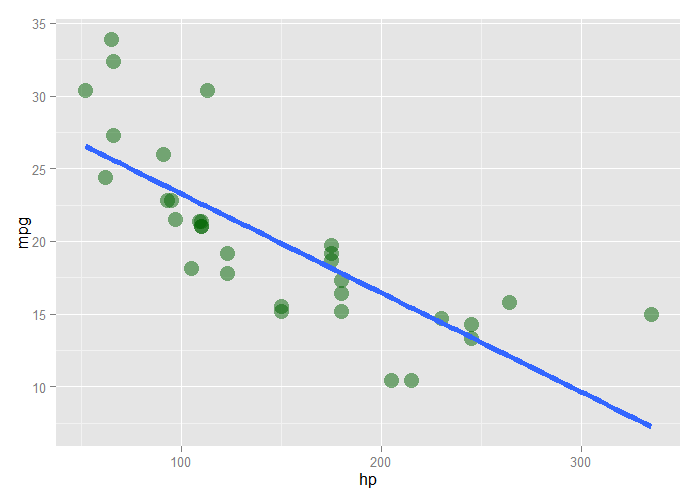

# Statistical Linear Regression Models - Exercises


## Question 1

Fit a linear regression model to the `father.son` dataset with the father as the predictor and the son as the outcome. Give a $p$-value for the slope coefficient and perform the relevant hypothesis test.

$$
ht_{son} = \beta_0 + \beta_1 ht_{father} + \epsilon_i \\
H_0 : \beta_1 = 0 \\
H_\alpha : \beta_1 \ne 0
$$


```r
library(UsingR)
data(father.son)
fit <- lm(sheight ~ fheight, data=father.son)
summary(fit)$coef
```

```
             Estimate Std. Error  t value     Pr(>|t|)
(Intercept) 33.886604 1.83235382 18.49348 1.604044e-66
fheight      0.514093 0.02704874 19.00618 1.121268e-69
```

**ANSWER:** Our fit estimates $\beta_1$ as 0.514 with a very high $t$-value (19.006) and a very low $p$-value (almost 0). Therefore the null hypothesis is rejected.

---

## Question 2

Refer to question 1. Interpret both parameters. Recenter for the intercept if necessary.


```r
fit.c <- lm(sheight ~ I(fheight - mean(fheight)), data=father.son)
summary(fit.c)$coef
```

```
                            Estimate Std. Error   t value     Pr(>|t|)
(Intercept)                68.684070 0.07421078 925.52689 0.000000e+00
I(fheight - mean(fheight))  0.514093 0.02704874  19.00618 1.121268e-69
```

**ANSWER:** The son's height for the average height of all fathers is 68.684. For every inch of father's height, we can predict 0.514 inches of the son's height.

---

## Question 3

Refer to question 1. Predict the son's height if the father's height is 80 niches. Would you recommend this prediction? Why or why not?


```r
predict(fit, newdata=data.frame(fheight=80))
```

```
       1 
75.01405 
```

```r
summary(father.son)
```

```
    fheight         sheight     
 Min.   :59.01   Min.   :58.51  
 1st Qu.:65.79   1st Qu.:66.93  
 Median :67.77   Median :68.62  
 Mean   :67.69   Mean   :68.68  
 3rd Qu.:69.60   3rd Qu.:70.47  
 Max.   :75.43   Max.   :78.36  
```

**ANSWER:** 75. This is not a reliable prediction, as the maximum heights in our sample set is lower than the value we're trying to predict. We have no estimate of variability at that height.

---

## Question 4

Load the `mtcars` dataset. Fit a linear regression with miles per gallon as the outcome and horsepower as the predictor. Interpret your coefficients, recenter for the intercept if necessary.


```r
data(mtcars)
summary(lm(mpg ~ I(hp - mean(hp)), data=mtcars))$coef
```

```
                    Estimate Std. Error   t value     Pr(>|t|)
(Intercept)      20.09062500  0.6828817 29.420360 1.101810e-23
I(hp - mean(hp)) -0.06822828  0.0101193 -6.742389 1.787835e-07
```

**ANSWER:** The `mpg` for a car w/ average `hp` is 20.091. For every unit of gross horsepower, we predict a -0.068 decrease in miles per gallon. This result is highly significant, with a $p$-value of nearly 0.

---

## Question 5

Refer to question 4. Overlay the fit onto a scatterplot.

**ANSWER:** See plot.


```r
library(ggplot2)
ggplot(mtcars, aes(x=hp, y=mpg)) +
    geom_point(cex=5, color="darkgreen", alpha=0.5) +
    geom_smooth(method="lm", se=F, lwd=2)
```

<div class="rimage center"></div>

---

## Question 6

Refer to question 4. Test they hypothesis of no linear relationship between horsepower and miles per gallon.

$$
mpg = \beta_0 + \beta_1 hp + \epsilon_i \\
H_0 : \beta_1 = 0 \\
H_\alpha : \beta_1 \ne 0
$$


```r
summary(lm(mpg ~ hp, data=mtcars))$coef
```

```
               Estimate Std. Error   t value     Pr(>|t|)
(Intercept) 30.09886054  1.6339210 18.421246 6.642736e-18
hp          -0.06822828  0.0101193 -6.742389 1.787835e-07
```

**ANSWER:** With a $\beta_1$ of -0.068 and a $p$-value of nearly 0, the null hypothesis of no linear relationship is rejected.

---

## Question 7

Refer to question 4. Predict the miles per gallong for a horsepower of 111


```r
summary(mtcars[,c("mpg","hp")])
```

```
      mpg              hp       
 Min.   :10.40   Min.   : 52.0  
 1st Qu.:15.43   1st Qu.: 96.5  
 Median :19.20   Median :123.0  
 Mean   :20.09   Mean   :146.7  
 3rd Qu.:22.80   3rd Qu.:180.0  
 Max.   :33.90   Max.   :335.0  
```

```r
fit <- lm(mpg ~ hp, data=mtcars)
predict(fit, newdata=data.frame(hp=111))
```

```
       1 
22.52552 
```

**ANSWER:** 22.526. Both the predicted mpg & the hp of 111 are reasonable values given our data.
