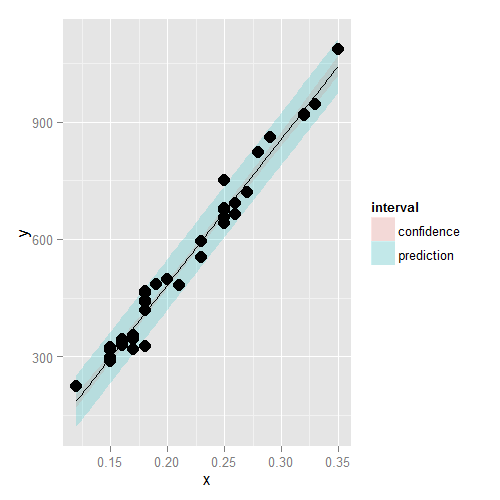
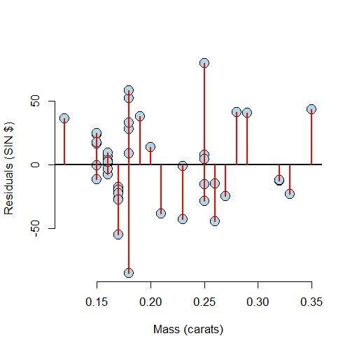

# Residuals and Residual Variation


## Motivating Example

###### `diamond` dataset from `UsingR`

Data is diamond prices (Singapore dollars) and diamond weight in carats (standard measure of diamong mass, 0.2 _g_). To get the data use `library(UsingR); data(diamond)`

---

<div class="rimage center"></div>

---

## Residuals

- Model $Y_i = \beta_0 + \beta_1 X_i + \epsilon_i$ where $\epsilon_i \sim N\left(0,\sigma^2\right)$
- Observed outcome $i$ is $Y_i$ at predictor value $X_i$
- Predicted outcome $i$ is $\hat Y_i$ at predictor value $X_i$ is
$$
\hat Y_i = \hat\beta_0 + \hat\beta_1 X_i
$$
- Residual, the difference between the observed and predicted outcome
$$
e_i = Y_i - \hat Y_i
$$
    - The vertical distance between the observed data point and the regression line
- Lease squares minimizes $\sum_{i=1}^n e_i^2$
- The $e_i$ can be thought of as estimates of the $\epsilon_i$

---

## Properties of the Residuals

- $E\left[e_i\right] = 0$
- If an intercept is included, $\sum_{i=1}^n e_i = 0$
- If a regressor variable, $X_i$ is included in the model, $\sum_{i=1}^n e_i X_i = 0$
- Residuals are useful for investigating poor model fit
- Positive residuals are above the line, negative residuals are below
- Residuals can be thought of as the outcome ($Y$) with the linear association of the predictor ($X$) removed
- One differentiates residual variation (variation after removing the predictor) from systematic variation (variation explained by the regression model)
- Residual plots highlight poor model fit

---

## Code


```r
data(diamond)
y <- diamond$price
x <- diamond$carat
n <- length(y)
fit <- lm(y ~ x)
e <- resid(fit)
yhat <- predict(fit)
max(abs(e - (y - yhat)))
```

```
[1] 9.485746e-13
```

```r
max(abs(e - (y - coef(fit)[1] - coef(fit)[2] * x)))
```

```
[1] 9.485746e-13
```

---

## Residuals Are the Signed Length of the Red Lines

<div class="rimage center"></div>

---

## Residuals Versus X

<div class="rimage center"></div>

---

## Non-linear Data

<div class="rimage center"></div>

---

## Residual Plot

<div class="rimage center"></div>

---

## Heteroskedasticity

<div class="rimage center"></div>

---

## Getting Rid of the Blank Space can be helpful

<div class="rimage center"></div>

---

## Diamond Data Residual Plot

<div class="rimage center"></div>

---

## Diamond Data Residual Plot

<div class="rimage center"></div>

---

## Estimating Residual Variation

- Model $Y_i = \beta_0 + \beta_1 X_i + \epsilon_i$ where $\epsilon_i \sim N\left(0,\sigma^2\right)$
- The ML estimate of $\sigma^2$ is $\frac{1}{n} \sum_{i=1}^n e_i^2$, the average squared residual
- Most people use
$$
\hat\sigma^2 = \frac{1}{n - 2}\sum_{i=1}^n e_i^2
$$
- The $n - 2$ instead of $n$ so that $E\left[\hat\sigma^2\right] = \sigma^2$

---

## Diamond Example


```r
y <- diamond$price
x <- diamond$carat
n <- length(y)
fit <- lm(y ~ x)
summary(fit)$sigma
```

```
[1] 31.84052
```

```r
sqrt(sum(resid(fit)^2) / (n - 2))
```

```
[1] 31.84052
```

---

## Summarizing Variation

- The total variability in our response is the variability around an intercept (think mean-only regression) $\sum_{i=1}^n \left(Y_i - \bar Y\right)^2$
- The regression variability is the variability that is explained by adding the predictor $\sum_{i=1}^n \left(\hat Y_i - \bar Y\right)^2$
- The error variability is what's leftover around the regression line $\sum_{i=1}^n \left(Y_i - \hat Y_i\right)^2$
- Neat fact
$$
\sum_{i=1}^n\left(Y_i - \bar Y\right)^2 = \sum_{i=1}^n\left(Y_i - \hat Y_i\right)^2 + \sum_{i=1}^n\left(\hat Y_i - \bar Y\right)^2
$$

---

## R Squared

- R Squared is the percentage of the total variability that is explained by the linear relationship with the predictor
$$
R^2 = \frac{\sum_{i=1}^n \left(\hat Y_i - \bar Y\right)^2}{\sum_{i=1}^n \left(Y_i - \bar Y\right)^2}
$$

---

## Some Facts about $R^2$

- $R^2$ is the percentage of variation explained by the regression model
- $0 \le R^2 \le 1$
- $R^2$ is the sample correlation squared
- $R^2$ can be a misleading summary of model fit
    - Deleting data can inflate $R^2$
    - (For later.) Adding terms to a regression model always increases $R^2$
- Do `example(anscombe)` to see the following data
    - Basically same mean and variance of $X$ and $Y$
    - Identical correlations (hence same $R^2$)
    - Same linear regression relationship

---

## `data(anscombe); example(anscombe)`


```r
require(stats)
require(graphics)
data(anscombe)
ff <- y ~ x
mods <- setNames(as.list(1:4), paste0("lm", 1:4))
for (i in 1:4) {
    ff[2:3] <- lapply(paste0(c("y","x"), i), as.name)
    mods[[i]] <- lmi <- lm(ff, data=anscombe)
    print(anova(lmi))
}
```

```
Analysis of Variance Table

Response: y1
          Df Sum Sq Mean Sq F value  Pr(>F)   
x1         1 27.510 27.5100   17.99 0.00217 **
Residuals  9 13.763  1.5292                   
---
Signif. codes:  0 '***' 0.001 '**' 0.01 '*' 0.05 '.' 0.1 ' ' 1
Analysis of Variance Table

Response: y2
          Df Sum Sq Mean Sq F value   Pr(>F)   
x2         1 27.500 27.5000  17.966 0.002179 **
Residuals  9 13.776  1.5307                    
---
Signif. codes:  0 '***' 0.001 '**' 0.01 '*' 0.05 '.' 0.1 ' ' 1
Analysis of Variance Table

Response: y3
          Df Sum Sq Mean Sq F value   Pr(>F)   
x3         1 27.470 27.4700  17.972 0.002176 **
Residuals  9 13.756  1.5285                    
---
Signif. codes:  0 '***' 0.001 '**' 0.01 '*' 0.05 '.' 0.1 ' ' 1
Analysis of Variance Table

Response: y4
          Df Sum Sq Mean Sq F value   Pr(>F)   
x4         1 27.490 27.4900  18.003 0.002165 **
Residuals  9 13.742  1.5269                    
---
Signif. codes:  0 '***' 0.001 '**' 0.01 '*' 0.05 '.' 0.1 ' ' 1
```

---

## Now, do what you should have done in the first place: PLOTS


```r
op <- par(mfrow=c(2,2), mar=0.1+c(4,4,1,1), oma=c(0,0,2,0))
for(i in 1:4) {
    ff[2:3] <- lapply(paste0(c("y","x"),i), as.name)
    plot(ff, data=anscombe, col="red", pch=21, bg="orange", cex=1.2,
         xlim=c(3,19), ylim=c(3,13))
    abline(mods[[i]], col="blue")
}
mtext("Anscombe's 4 Regression Datasets", outer=T, cex=1.5)
```

<div class="rimage center"></div>

```r
par(op)
```

---

## How to Derive $R^2$ (Not required!)

###### For those that are interested
$$
\begin{eqnarray*}
\sum_{i=1}^n \left(Y_i - \bar Y\right)^2 \
& = & \sum_{i=1}^n \left(Y_i - \hat Y_i + \hat Y_i - \bar Y\right)^2 \\
& = & \sum_{i=1}^n \left(Y_i - \hat Y_i\right)^2 + 2\sum_{i=1}^n \left(Y_i - \hat Y_i\right)\left(\hat Y_i - \bar Y\right) + \sum_{i=1}^n \left(\hat Y_i - \bar Y\right)^2
\end{eqnarray*}
$$

---

## The Relationship Between $R^2$ and _r_

###### Again, not required

Recall that $\left(\hat Y_i - \bar Y\right) = \hat\beta_1\left(X_i - \bar X\right)$ so that

$$
R^2 = \frac{\sum_{i=1}^n \left(\hat Y_i - \bar Y\right)^2}{\sum_{i=1}^n \left(Y_i - \bar Y\right)^2} = \hat\beta_1^2 \frac{\sum_{i=1}^n \left(X_i - \bar X\right)^2}{\sum_{i=1}^n \left(Y_i - \bar Y\right)^2} = Cor\left(Y,X\right)^2
$$

Since, recall,

$$
\hat\beta_1 = Cor\left(Y,X\right) \frac{Sd\left(Y\right)}{Sd\left(X\right)}
$$

So, $R^2$ is literally $r$ squared
