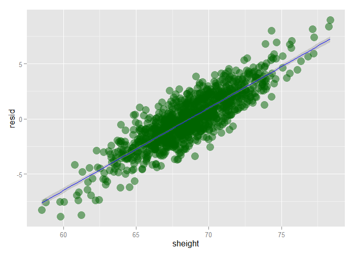
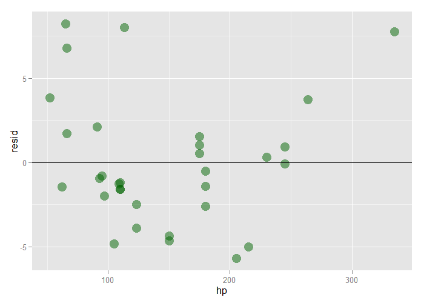

# Residuals and Residual Variation - Exercises


## Question 1

Fit a linear regression model to the `father.son` dataset th the father as the predictor and the son as the outcome. Plot the father's height (horizontal axis) versus the residuals (vertical axis).

**ANSWER:** See plot.


```r
library(UsingR)
library(ggplot2)
data(father.son)
fit <- lm(sheight ~ fheight, father.son)
father.son$resid <- fit$residuals
ggplot(father.son, aes(x=fheight, y=resid)) +
    geom_point(size=5, color="darkgreen", alpha=0.5) +
    geom_hline(yintercept=0, color="blue")
```

<div class="rimage center"></div>

---

## Question 2

Refer to question 1. Directly estimate the residual variance and compare this estimate to the output of lm

**ANSWER:** See R code.


```r
n <- nrow(father.son)
s1 <- summary(fit)$sigma
s2 <- sqrt(sum(father.son$resid^2) / (n - 2))
s1
```

```
[1] 2.436556
```

```r
s2
```

```
[1] 2.436556
```

```r
all.equal(s1, s2)
```

```
[1] TRUE
```

---

## Question 3

Refer to question 1. Give the $R^2$ for this model


```r
summary(fit)$r.squared
```

```
[1] 0.2513401
```

**ANSWER:** 0.2513401

---

## Question 4

Load the `mtcars` dataset. Fit a linear regression with miles per gallon as the outcome and horsepower as the predictor. Plot horsepower versus the residuals.

**ANSWER:** See plot. The curvature suggests linear may not be the best fit.


```r
data(mtcars)
fit <- lm(mpg ~ hp, mtcars)
mtcars$resid <- fit$residuals
ggplot(mtcars, aes(x=hp, y=resid)) +
    geom_point(size=5, color="darkgreen", alpha=0.5) +
    geom_hline(yintercept=0, "blue")
```

<div class="rimage center"></div>

---

## Question 5

Refer to question 4. Directly estimate the residual variance and compare this estimate to the output of lm.

**ANSWER:** See R code.


```r
n <- nrow(mtcars)
s1 <- summary(fit)$sigma
s2 <- sqrt(sum(mtcars$resid^2) / (n - 2))
s1
```

```
[1] 3.862962
```

```r
s2
```

```
[1] 3.862962
```

```r
all.equal(s1, s2)
```

```
[1] TRUE
```

---

## Question 6

Refer to question 4. Give the $R^2$ for this model


```r
summary(fit)$r.squared
```

```
[1] 0.6024373
```

**ANSWER:** 0.6024373
