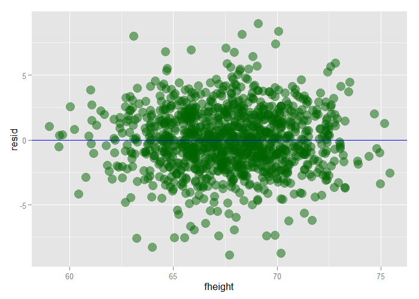

# Residuals and Residual Variation - Exercises


## Question 1

Fit a linear regression model to the `father.son` dataset th the father as the predictor and the son as the outcome. Plot the son's height (horizontal axis) versus the residuals (vertical axis).

**ANSWER:** See plot.


```r
library(UsingR)
library(ggplot2)
data(father.son)
father.son$resid <- lm(sheight ~ fheight, father.son)$residuals
ggplot(father.son, aes(x=sheight, y=resid)) +
    geom_point(size=5, color="darkgreen", alpha=0.5) +
    geom_smooth(method="lm", color="blue")
```

<div class="rimage center"></div>

---
