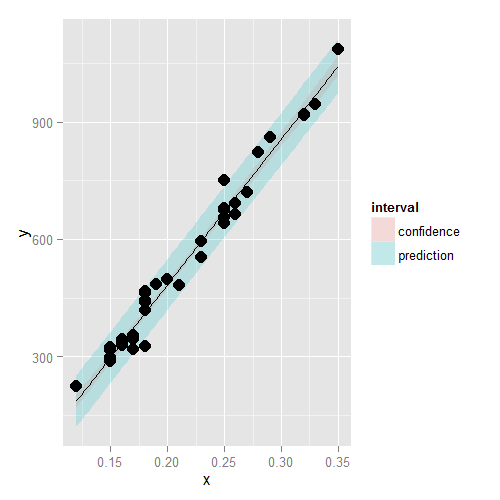

# Inference in Regression


## Recall Our Model and Fitted Values

- Consider the model
$$
Y_i = \beta_0 + \beta_1 X_i + \epsilon_i
$$
- $\epsilon \sim N\left(0,\sigma^2\right)$
- We assume that the true model is known
- We assume that you've seen confidence intervals and hypothesis tests before
- $\hat\beta_0 = \bar Y - \hat\beta_1 \bar X$
- $\hat\beta_1 = Cor\left(Y,X\right) \frac{Sd\left(Y\right)}{Sd\left(X\right)}$

---

## Review

- Statistics like $\frac{\hat\theta - \theta}{\hat\sigma_{\hat\theta}}$ often have the following properties
    1. Is normally distributed and has a finite sample Student's T distribution if the variance is replaced with a sample estimate (under normality assumptions)
    2. Can be used to test $H_0 : \theta = \theta_0$ versus $H_\alpha : \theta >,<,\ne \theta_0$
    3. Can be used to create a confidence interval for $\theta$ via $\hat\theta \pm Q_{1-\alpha/2} \hat\sigma_{\hat\theta}$ where $Q_{1-\alpha/2}$ is the relevant quantile from either a normal or $t$ distribution
- In the case of regression with iid sampling assumptions and normal errors, our inferences will follow very similarily to what you saw in your inference class
- We won't cover asymptotics for regression analysis, but suffice it to say that under assumptions on the ways in which the $X$ values are collected, the iid sampling model, and mean model, the normal results hold to create intervals and confidence intervals

---

## Results

- $\sigma_{\hat\beta_1}^2 = Var\left(\hat\beta_1\right) = \sigma^2 / \sum_{i=1}^2\left(X_i - \bar X\right)^2$
- $\sigma_{\hat\beta_0}^2 = Var\left(\hat\beta_0\right) = \left(\frac{1}{n} + \frac{X^{-2}}{\sum_{i=1}^n\left(X_i - \bar X\right)}\right) \sigma^2$
- In practice, $\sigma$ is replaced by its estimate
- It's probably not surprising that under iid Gaussian errors
$$
\frac{\hat\beta_j - \beta_j}{\hat\sigma_{\hat\beta_j}}
$$
follows a $t$ distribution with $n - 2$ degrees of freedom and a normal distribution for large $n$
- This can be used to create confidence intervals and perform hypothesis tests

---

## Example Diamond Dataset


```r
library(UsingR)
data(diamond)
y <- diamond$price
x <- diamond$carat
n <- length(y)
beta1 <- cor(y,x) * sd(y)/sd(x)
beta0 <- mean(y) - beta1 * mean(x)
e <- y - beta0 - beta1 * x
sigma <- sqrt(sum(e^2) / (n-2))
ssx <- sum((x - mean(x))^2)
seBeta0 <- (1 / n + mean(x)^2 / ssx) ^ .5 * sigma
seBeta1 <- sigma / sqrt(ssx)
tBeta0 <- beta0 / seBeta0
tBeta1 <- beta1 / seBeta1
pBeta0 <- 2 * pt(abs(tBeta0), df=n - 2, lower.tail=F)
pBeta1 <- 2 * pt(abs(tBeta1), df=n - 2, lower.tail=F)
coefTable <- rbind(c(beta0, seBeta0, tBeta0, pBeta0),
                   c(beta1, seBeta1, tBeta1, pBeta1))
colnames(coefTable) <- c("Estimate", "Std. Error", "t value", "P(>|t|)")
rownames(coefTable) <- c("(Intercept)", "x")
coefTable
```

```
             Estimate Std. Error   t value      P(>|t|)
(Intercept) -259.6259   17.31886 -14.99094 2.523271e-19
x           3721.0249   81.78588  45.49715 6.751260e-40
```

```r
fit <- lm(y ~ x)
summary(fit)$coefficients
```

```
             Estimate Std. Error   t value     Pr(>|t|)
(Intercept) -259.6259   17.31886 -14.99094 2.523271e-19
x           3721.0249   81.78588  45.49715 6.751260e-40
```

---

## Getting a Confidence Interval


```r
sumCoef <- summary(fit)$coefficients
sumCoef[1,1] + c(-1,1) * qt(.975, df=fit$df) * sumCoef[1,2]
```

```
[1] -294.4870 -224.7649
```

```r
(sumCoef[2,1] + c(-1,1) * qt(.975, df=fit$df) * sumCoef[2,2]) / 10
```

```
[1] 355.6398 388.5651
```

With 95% confidence, we estimate that a 0.1 carat increase in diamond size results in a 355.6 to 388.6 increase in (Singapore) dollars

---

## Prediction of Outcomes

- Consider predicting $Y$ at a value of $X$
    - Predicting the price of a diamond given a carat
    - Predicting the height of a child given the height of the parents
- The obvious estimate for prediction at point $x_0$ is
$$
\hat\beta_0 + \hat\beta_1 x_0
$$
- A standard error is needed to create a prediction interval
- There's a distinction between intervals for the regression line at point $x_0$ and the prediction of what a $y$ would be at point $x_0$
- Line at $x_0$ se, $\hat\sigma \sqrt{\frac{1}{n} + \frac{\left(x_0 - \bar X\right)^2}{\sum_{i=1}^n \left(X_i - \bar X\right)^2}}$
- Prediction interval se at $x_0$, $\hat\sigma \sqrt{1 + \frac{1}{n} + \frac{\left(x_0 - \bar X\right)^2}{\sum_{i=1}^n \left(X_i - \bar X\right)^2}}$

---

## Plotting the Prediction Intervals

<div class="rimage center"></div>

---

## Discussion

- Both intervals have varying widths
    - Least width at the means of the $x$s
- We are quite confident in the regression line, so that interval is very narrow
    - If we knew $\beta_0$ and $\beta_1$ this interval would have zero width
- The prediction interval must incorporate the variability in the data around the line
    - Even if we knew $\beta_0$ and $\beta_1$ this interval would still have width

---

## In R

This content is missing from the available slides
