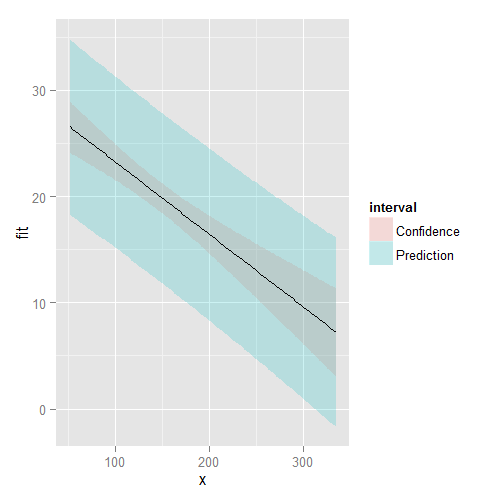

# Inference in Regression - Exercises


## Question 1

Test whether the slope coefficient for the father.son data is different from zero (father as predictor, son as outcome)

$$
H_0 : \hat\beta_1 = 0 \\
H_\alpha : \hat\beta_1 \ne 0
$$


```r
library(UsingR)
data(father.son)
y <- father.son$sheight
x <- father.son$fheight
fs.fit <- lm(y ~ x)
fs.coef <- summary(fs.fit)$coefficients
fs.coef
```

```
             Estimate Std. Error  t value     Pr(>|t|)
(Intercept) 33.886604 1.83235382 18.49348 1.604044e-66
x            0.514093 0.02704874 19.00618 1.121268e-69
```

**ANSWER:** $\hat\beta_1$ is 0.514, with a $p$-value of 0. Therefore we reject the null hypothesis

---

## Question 2

Refer to question 1. Form a confidence interval for the slope coefficient.


```r
confint(fs.fit)[2,]
```

```
    2.5 %    97.5 % 
0.4610188 0.5671673 
```

**ANSWER:** CI at 95% confidence is 0.461 to 0.567

---

## Question 3

Refer to question 1. Form a confidence interval for the intercept (center the father's height first to get an intercept that is easier to interpret)


```r
fs.fit.c <- lm(y ~ I(x - mean(x)))
confint(fs.fit.c)[1,]
```

```
   2.5 %   97.5 % 
68.53846 68.82968 
```

**ANSWER:** The son's height around the mean father's height has a CI at 95% confidence of 68.538 to 68.830

---

## Question 4

Refer to question 1. Form a mean value interval for the expected son's height at the average father's height.


```r
predict(fs.fit, newdata=data.frame(x=mean(x)), interval="confidence")
```

```
       fit      lwr      upr
1 68.68407 68.53846 68.82968
```

**ANSWER:** 68.684 w/ CI at 95% of 68.538 to 68.830

---

## Question 5

Refer to question 1. Form a prediction interval for the son's height at the average father's height.


```r
predict(fs.fit, newdata=data.frame(x=mean(x)), interval="prediction")
```

```
       fit      lwr      upr
1 68.68407 63.90091 73.46723
```

**ANSWER:** 68.684 w/ CI at 95% of 63.901 and 73.467

---

## Question 6

Load the `mtcars` dataset. Fit a linear regression with miles per gallong as the outcome and horsepower as the predictor. Test whether or not the horsepower coefficient is statistically different from zero. Interpret your test.

$$
H_0 : \hat\beta_1 = 0 \\
H_\alpha : \hat\beta_1 \ne 0
$$


```r
data(mtcars)
y <- mtcars$mpg
x <- mtcars$hp
cars.fit <- lm(y ~ x)
summary(cars.fit)$coefficients
```

```
               Estimate Std. Error   t value     Pr(>|t|)
(Intercept) 30.09886054  1.6339210 18.421246 6.642736e-18
x           -0.06822828  0.0101193 -6.742389 1.787835e-07
```

**ANSWER:** $\hat\beta_1$ is -0.068, with a $p$-value of 0. Therefore we reject the null hypothesis.

---

## Question 7

Refer to question 6. Form a confidence interval for the slope coefficient.


```r
confint(cars.fit)[2,]
```

```
      2.5 %      97.5 % 
-0.08889465 -0.04756190 
```

**ANSWER:** Slope CI at 95% is -0.089 to -0.048

---

## Question 8

Refer to question 6. Form a confidence interval for the intercept (center the HP variable first)


```r
cars.fit.c <- lm(y ~ I(x - mean(x)))
confint(cars.fit.c)[1,]
```

```
   2.5 %   97.5 % 
18.69599 21.48526 
```

**ANSWER:** (Centered) Intercept CI at 95% is 18.696 to 21.485.

---

## Question 9

Refer to question 6. Form a mean value interval for the expected MPG for the average HP.


```r
predict(cars.fit, newdata=data.frame(x=mean(x)), interval="confidence")
```

```
       fit      lwr      upr
1 20.09062 18.69599 21.48526
```

**ANSWER:** 20.091 w/ CI at 95% of 18.696 to 21.485

---

## Question 10

Refer to question 6. Form a prediction interval for the expected MPG for the average HP.


```r
predict(cars.fit, newdata=data.frame(x=mean(x)), interval="prediction")
```

```
       fit      lwr      upr
1 20.09062 12.07908 28.10217
```

**ANSWER:** 20.091 w/ CI at 95% of 12.079 to 28.102.

---

## Question 11

Refer to question 6. Create a plot that has the fitted regression line plus curves at the expected values and prediction interval.

**ANSWER:** See plot

<div class="rimage center"></div>
