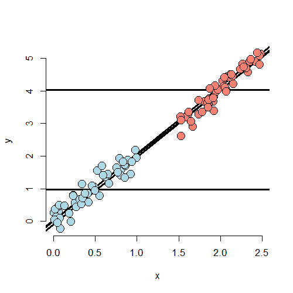

# Residuals, Diagnostics, & Variation


## The Linear Model

- Specified as $Y_i = \sum_{k=1}^p X_{ik} \beta_j + \epsilon_i$
- We'll also assume here that $\epsilon_i \stackrel{iid}{\sim} N\left(0, \sigma^2\right)$
- Define the residuals as $e_i = Y_i - \hat Y_i = Y_i - \sum_{k=1}^p X_{ik} \hat\beta_j$
- Our estimate of residual variation is $\hat\sigma^2 = \frac{\sum_{i=1}^n e_i^2}{n - p}$, the $n - p$ so that $E\left[\hat\sigma^2\right] = \sigma^2$

---


```r
data(swiss)
par(mfrow=c(2,2))
fit <- lm(Fertility ~ ., swiss)
plot(fit)
```

<div class="rimage center"></div>

---

## Influential, High Leverage, and Outlying Points

<div class="rimage center"></div>

---

## Summary of the Plot

Calling a point an outlier is vauge

- Outliers can be the result of spurious or real processes
- Outliers can have varying degrees of influence
- Outliers can conform to the regression relationship (i.e. being marginally outlying in $X$ or $Y$, but not outlying given the regression relationship)
    - Upper left hand point has low leverage, low influence, outlies in a way not conforming to the regression relationship
    - Lower left hand point has low leverage, low influence, and is not to be an outlier in any sense
    - Upper right hand point has high leverage, but chooses not to exert it and thus would have low actual influence by conforming to the regression relationship
    - Lower right hand point has high leverege and would exert it if it were included in the fit
    
---

## Influence Measures

- Do `?influence.measures` to see the full suite of influence measures in stats. The measures include:
    - `rstandard` - standardized residuals, residuals divided by their standard deviation
    - `rstudent` - standardized residuals, residuals divided by their standard deviations, where the $i^{th}$ data point was deleted in the calculation of the standard deviation for the residual to follow a $t$ distributio
    - `hatvalues` - measures the leverage
    - `dffits` - change in the predicted response when the $i^{th}$ point is deleted in fitting the model
    - `dfbetas` - change in the individual coefficients when the $i^{th}$ point is deleted in fitting the model
    - `cooks.distance` - overall change in the coefficients when the $i^{th}$ point is deleted
    - `resid` - returns the ordinary residuals
    - `resid(fit) / (1 - hatvalues(fit))` where `fit` is the linear model fit. Returns the PRESS residuals, i.e. the leave-out-one cross-validation residuals - the difference in the response and the predicted response at data point $i$ where it was not included in the model fitting
    
---

