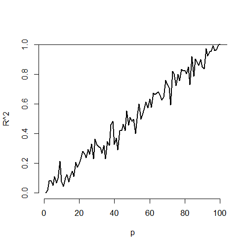
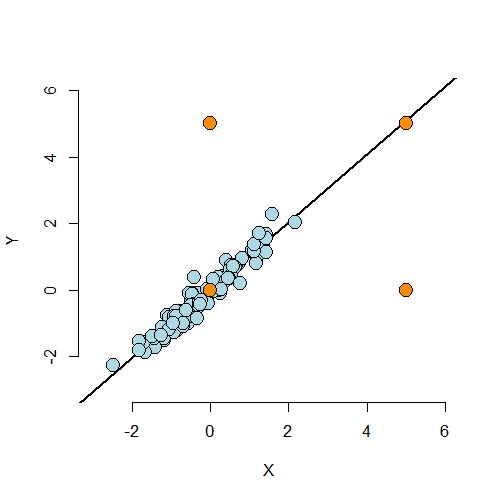
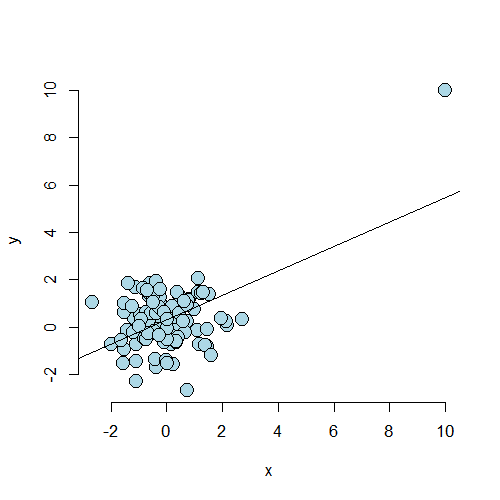

# Residuals, Diagnostics, & Variation


## The Linear Model

- Specified as $Y_i = \sum_{k=1}^p X_{ik} \beta_j + \epsilon_i$
- We'll also assume here that $\epsilon_i \stackrel{iid}{\sim} N\left(0, \sigma^2\right)$
- Define the residuals as $e_i = Y_i - \hat Y_i = Y_i - \sum_{k=1}^p X_{ik} \hat\beta_j$
- Our estimate of residual variation is $\hat\sigma^2 = \frac{\sum_{i=1}^n e_i^2}{n - p}$, the $n - p$ so that $E\left[\hat\sigma^2\right] = \sigma^2$

---


```r
data(swiss)
par(mfrow=c(2,2))
fit <- lm(Fertility ~ ., swiss)
plot(fit)
```

<div class="rimage center"></div>

---

## Influential, High Leverage, and Outlying Points

<div class="rimage center"></div>

---

## Summary of the Plot

Calling a point an outlier is vauge

- Outliers can be the result of spurious or real processes
- Outliers can have varying degrees of influence
- Outliers can conform to the regression relationship (i.e. being marginally outlying in $X$ or $Y$, but not outlying given the regression relationship)
    - Upper left hand point has low leverage, low influence, outlies in a way not conforming to the regression relationship
    - Lower left hand point has low leverage, low influence, and is not to be an outlier in any sense
    - Upper right hand point has high leverage, but chooses not to exert it and thus would have low actual influence by conforming to the regression relationship
    - Lower right hand point has high leverege and would exert it if it were included in the fit
    
---

## Influence Measures

- Do `?influence.measures` to see the full suite of influence measures in stats. The measures include:
    - `rstandard` - standardized residuals, residuals divided by their standard deviation
    - `rstudent` - standardized residuals, residuals divided by their standard deviations, where the $i^{th}$ data point was deleted in the calculation of the standard deviation for the residual to follow a $t$ distributio
    - `hatvalues` - measures the leverage
    - `dffits` - change in the predicted response when the $i^{th}$ point is deleted in fitting the model
    - `dfbetas` - change in the individual coefficients when the $i^{th}$ point is deleted in fitting the model
    - `cooks.distance` - overall change in the coefficients when the $i^{th}$ point is deleted
    - `resid` - returns the ordinary residuals
    - `resid(fit) / (1 - hatvalues(fit))` where `fit` is the linear model fit. Returns the PRESS residuals, i.e. the leave-out-one cross-validation residuals - the difference in the response and the predicted response at data point $i$ where it was not included in the model fitting
    
---

## How Do I Use All of These Things?

- Be wary of simplistic rules for diagnostic plots and measures. The use of these tools is context specific. It's better to understand what they are trying to accomplish and use them judiciously.
- Not all of the measures have meaningful absolute scales. You can look at them relative to the values across the data.
- They probe your data in different ways to diagnose different problems.
- Patterns in your residual plots generally indicate some poor aspect of model fit. These can include:
    - Heteroskedasticity (non-constant variance)
    - Missing model terms
    - Temporal patterns (plot residuals versus collection order)
- Residual QQ plots investigate normality of the errors
- Leverage measures (hat values) can be useful for diagnosing data entry errors.
- Influence measures get to the bottom line, "how does deleting or including this point impact a particular aspect of the model?"

---

## Case 1

<div class="rimage center"></div>

---

## The Code

```
x <- c(10, rnorm(n))
y <- c(10, c(norm(n)))
plot(x, y, frame=F, cex=2, pch=21, bg="lightblue", col="black")
abline(lm(y ~ x))
```

---

## Showing a Couple of the Diagnostic Values


```r
fit <- lm(y ~ x)
round(dfbetas(fit)[1:10,2], 3)
```

```
     1      2      3      4      5      6      7      8      9     10 
 6.670 -0.003  0.020 -0.005  0.046 -0.013 -0.050 -0.116  0.079 -0.043 
```

```r
round(hatvalues(fit)[1:10],3)
```

```
    1     2     3     4     5     6     7     8     9    10 
0.518 0.010 0.011 0.010 0.011 0.010 0.012 0.017 0.016 0.011 
```

---

## Case 2

<div class="rimage center"></div>

---

## Looking at Some of the Diagnostics


```r
round(dfbetas(fit2)[1:10,2], 3)
```

```
     1      2      3      4      5      6      7      8      9     10 
-0.405 -0.246  0.022  0.115 -0.007 -0.030  0.118  0.012 -0.051  0.001 
```

```r
round(hatvalues(fit2)[1:10], 3)
```

```
    1     2     3     4     5     6     7     8     9    10 
0.248 0.025 0.010 0.023 0.010 0.015 0.017 0.010 0.018 0.019 
```

---

## Example Described by Stefanski TAS 2007 Vol 61.


```r
dat <- read.table('http://www4.stat.ncsu.edu/~stefanski/NSF_Supported/Hidden_Images/orly_owl_files/orly_owl_Lin_4p_5_flat.txt', header = FALSE)
pairs(dat)
```

<div class="rimage center"></div>

---

## Got Our $p$-values, Should We Bother To Do a Residual Plot?


```r
summary(lm(V1 ~ . - 1, dat))$coef
```

```
    Estimate Std. Error   t value     Pr(>|t|)
V2 0.9856157 0.12798121  7.701253 1.989126e-14
V3 0.9714707 0.12663829  7.671225 2.500259e-14
V4 0.8606368 0.11958267  7.197003 8.301184e-13
V5 0.9266981 0.08328434 11.126919 4.778110e-28
```

---

## Residual Plot


```r
fit <- lm(V1 ~ . - 1, dat)
plot(predict(fit), resid(fit), pch='.')
```

<div class="rimage center"></div>

---

## Back to the Swiss Data

<div class="rimage center"></div>
