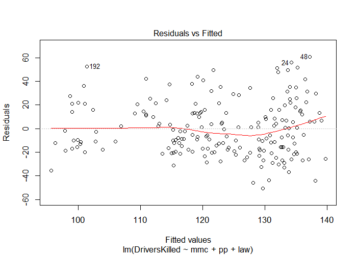
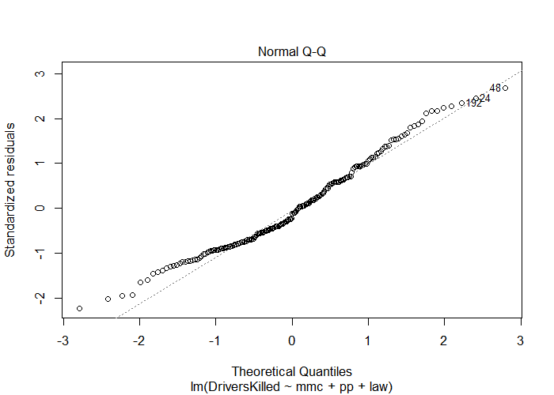
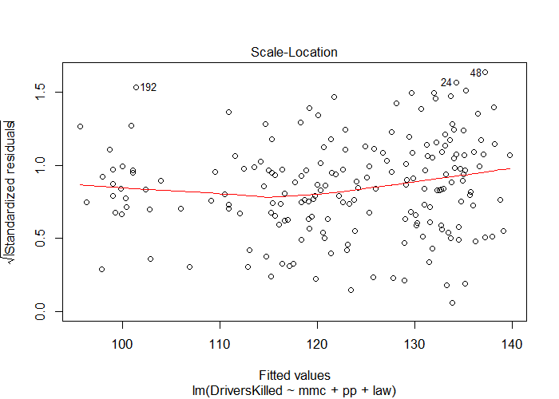
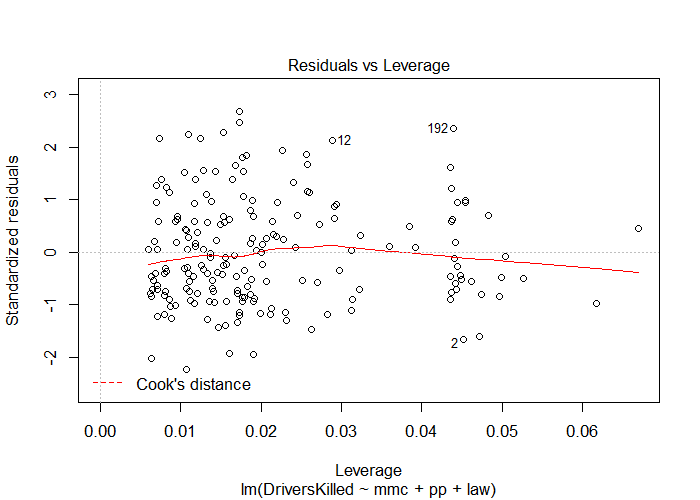
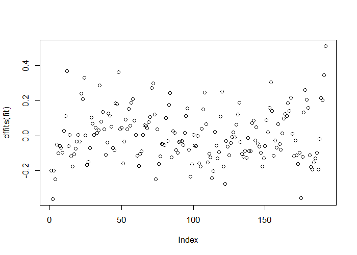
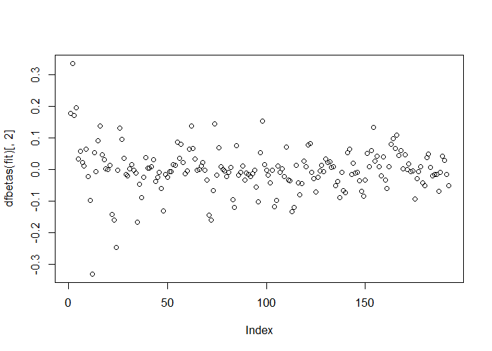
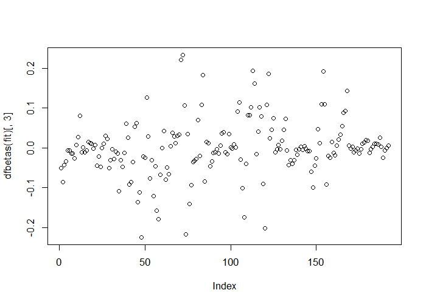
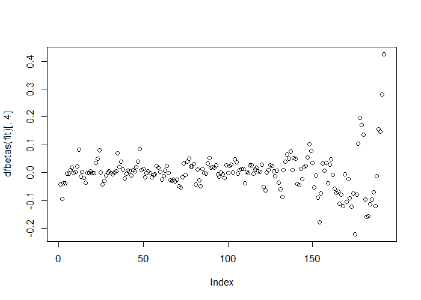
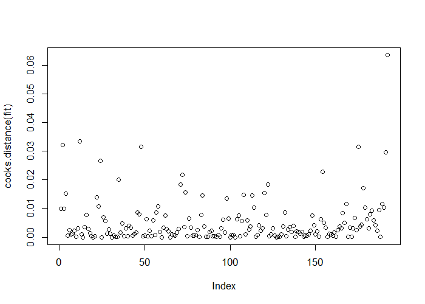
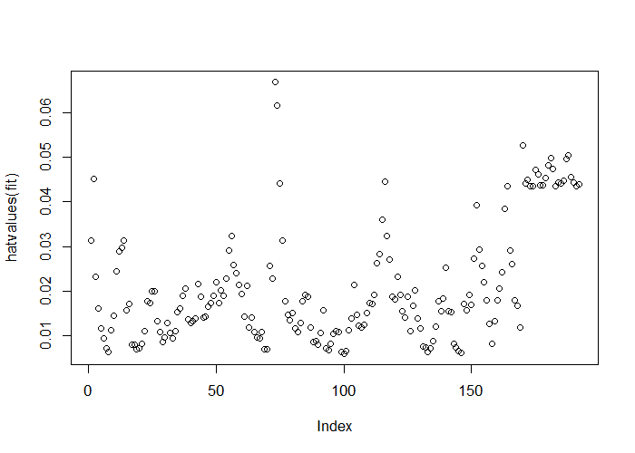

# Residuals, Diagnostics, & Variation - Exercises


## Question 1

Load the dataset `Seatbelts` as part of the `datasets` package via `data(Seatbelts)`. Use `as.data.frame` to convert the object to a dataframe. Fit a linear model of driver deaths w/ `kms`, `PetrolPrice`, and `law` as predictors

**ANSWER:** See R code below.


```r
library(datasets)
library(dplyr)
data(Seatbelts)
sb <- as.data.frame(Seatbelts)
sb <- mutate(sb,
             pp=(PetrolPrice - mean(PetrolPrice)) / sd(PetrolPrice),
             mm=kms / 1000,
             mmc=mm - mean(mm))
fit <- lm(DriversKilled ~ mmc + pp + law, sb)
summary(fit)
```

```

Call:
lm(formula = DriversKilled ~ mmc + pp + law, data = sb)

Residuals:
   Min     1Q Median     3Q    Max 
-50.69 -17.29  -4.05  14.33  60.71 

Coefficients:
            Estimate Std. Error t value Pr(>|t|)    
(Intercept) 124.2263     1.8012  68.967  < 2e-16 ***
mmc          -1.2233     0.6657  -1.838 0.067676 .  
pp           -6.9199     1.8514  -3.738 0.000246 ***
law         -11.8892     6.0258  -1.973 0.049955 *  
---
Signif. codes:  0 '***' 0.001 '**' 0.01 '*' 0.05 '.' 0.1 ' ' 1

Residual standard error: 22.87 on 188 degrees of freedom
Multiple R-squared:  0.201,	Adjusted R-squared:  0.1882 
F-statistic: 15.76 on 3 and 188 DF,  p-value: 3.478e-09
```

---

## Question 2

Refer to question 1. Directly estimate the residual variation via the function `resid`. Compare with R's residual variation estimate.

**ANSWER:** See R code below.


```r
summary(fit)$sigma^2
```

```
[1] 522.8903
```

```r
sum(resid(fit)^2)/fit$df
```

```
[1] 522.8903
```

---

## Question 3

Refer to question 1. Perform an analysis of diagnostic measures including dffits, dfbetas, influence, and hat diagonals.


```r
plot(fit)
```

<div class="rimage center"></div>
<div class="rimage center"></div>
<div class="rimage center"></div>
<div class="rimage center"></div>

```r
plot(dffits(fit))
```

<div class="rimage center"></div>

```r
plot(dfbetas(fit)[,2])
```

<div class="rimage center"></div>

```r
plot(dfbetas(fit)[,3])
```

<div class="rimage center"></div>

```r
plot(dfbetas(fit)[,4])
```

<div class="rimage center"></div>

```r
plot(cooks.distance(fit))
```

<div class="rimage center"></div>

```r
plot(hatvalues(fit))
```

<div class="rimage center"></div>

**ANSWER:** The observations toward the end of the frame deserve some greater scrutiny, based on the hat values & cooks distance for those records. In particular, `law` may be involved, based on the influence those observations have on $\beta_{law}$. The first observation's `PetrolPrice` also could be scrutinized.
