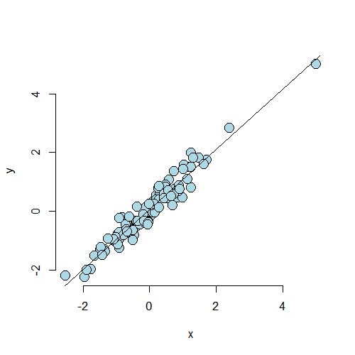
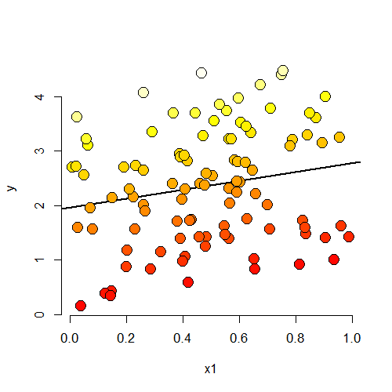
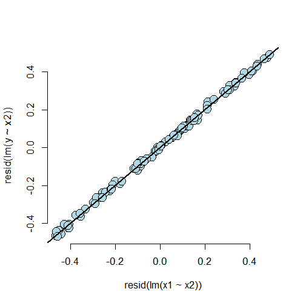
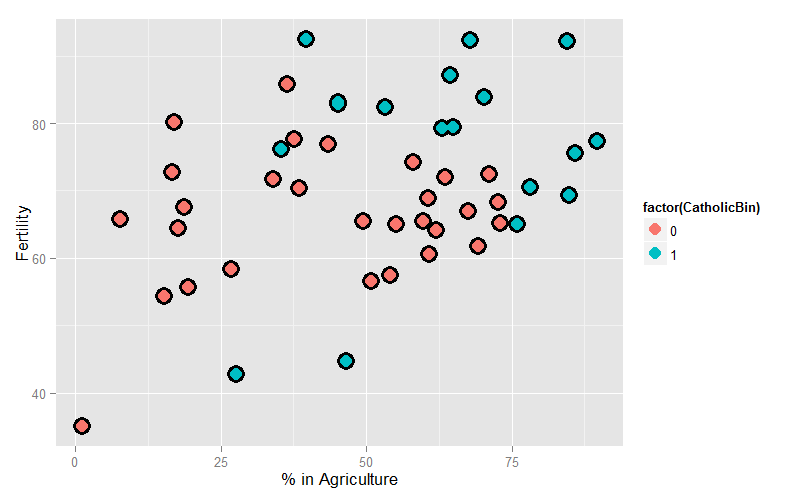

# Multivariable Regression Examples


## Dataset for Discussion

#### `require(datasets); data(swiss); ?swiss`

Standardized fertility measure and socio-economic indicators for each of 47 French-speaking provinces of Switzerland at about 1888.

A data frame with 47 observations on 6 variables, each of which is in percent, i.e., in [0, 100].

- [,1] Fertility - a common standardized fertility measure
- [,2] Agriculture - % of males involved in agriculture as occupation
- [,3] Examination - % draftees receiving highest mark on army examination
- [,4] Education - % education beyond primary school for draftees
- [,5] Catholic - % catholic (as opposed to protestant)
- [,6] Infant.Mortality - live births who live less than 1 year

All variables but `Fertility` give proportions of population.

---

<div class="rimage center"></div>

---

## Calling `lm`


```r
summary(lm(Fertility ~ ., data=swiss))$coefficients
```

```
                   Estimate  Std. Error   t value     Pr(>|t|)
(Intercept)      66.9151817 10.70603759  6.250229 1.906051e-07
Agriculture      -0.1721140  0.07030392 -2.448142 1.872715e-02
Examination      -0.2580082  0.25387820 -1.016268 3.154617e-01
Education        -0.8709401  0.18302860 -4.758492 2.430605e-05
Catholic          0.1041153  0.03525785  2.952969 5.190079e-03
Infant.Mortality  1.0770481  0.38171965  2.821568 7.335715e-03
```

---

## Example Interpretation

- Agriculture is expressed in percentages (0 - 100)
- Estimate is -0.1721
- Our models estimates an expected 0.17 decrease in standardized fertility for every 1% increase in percentage of males involved in agriculture in holding the remaining variables constant.
- The $t$-test for $H_0 : \beta_{Agri} = 0$ versus $H_\alpha : \beta_{Agri} \ne 0$ is significant
- Interestingly, the unadjusted estimate is


```r
summary(lm(Fertility ~ Agriculture, data=swiss))$coefficients
```

```
              Estimate Std. Error   t value     Pr(>|t|)
(Intercept) 60.3043752 4.25125562 14.185074 3.216304e-18
Agriculture  0.1942017 0.07671176  2.531577 1.491720e-02
```

---

How can adjustment reverse the sign of an effect? Let's try a simulation.


```r
n <- 100
x2 <- 1:n
x1 <- .01 * x2 + runif(n, -.1, .1)
y <- -x1 + x2 + rnorm(n, sd=.01)
summary(lm(y ~ x1))$coefficients
```

```
             Estimate Std. Error   t value     Pr(>|t|)
(Intercept)  1.103184   1.039556  1.061207 2.912043e-01
x1          96.137343   1.772138 54.249351 6.524033e-75
```

```r
summary(lm(y ~ x1 + x2))$coefficients
```

```
                Estimate   Std. Error     t value      Pr(>|t|)
(Intercept) -0.001097209 0.0020591373   -0.532849  5.953568e-01
x1          -0.988835951 0.0196357122  -50.359057  2.408260e-71
x2           0.999897739 0.0001989274 5026.444660 1.751766e-264
```

---

<div class="rimage center"></div>

---

<div class="rimage center"></div>

---

## Back to This Dataset

- The sign reverses itself with the inclusion of `Examination` and `Education`
- The percent of males in the province working in agriculture is negatively related to educational attainment (correlation of -0.6395) and `Education` and `Examination` (correlation of 0.6984) are obviously measuring similar things
    - Is the positive marginal an artifact for not having accounted for, say, `Education` level? (`Education` does have a stronger effect, by the way)
- At the minimum, anyone claiming that provinces that are more agricultural have higher fertility rates would immediately be open to criticism

---

## What If We Include an Unnecessary Value?

`z` adds no new linear information, since it's a linear combination of variables already included. R just drops terms that are linear combinations of other terms.


```r
z <- swiss$Agriculture + swiss$Education
lm(Fertility ~ . + z, swiss)
```

```

Call:
lm(formula = Fertility ~ . + z, data = swiss)

Coefficients:
     (Intercept)       Agriculture       Examination         Education          Catholic  
         66.9152           -0.1721           -0.2580           -0.8709            0.1041  
Infant.Mortality                 z  
          1.0770                NA  
```

---

## Dummy Variables Are Smart

- Consider the linear model
$$
Y_i = \beta_0 + X_{1i}\beta_1 + \epsilon_i
$$
where each $X_{1i} is binary so that it is a 1 if measurement $i$ is in a group and 0 otherwise (treated versus not in a clinical trial, for example)
- Then for people in the group $E\left[Y_i\right] = \beta_0 + \beta_1$
- And for people not in the group $E\left[Y_i\right] = \beta_0$
- The LS fits work out to be $\hat\beta_0 + \hat\beta_1$ is the mean for those in the group and $\hat\beta_0$ is the mean for those not in the group
- $\beta_1$ is interpretted as the increase or decrease in the mean comparing those in the group to those not
- Note including a binary variable that is 1 for those not in the group would be redundant. it would create three parameters to describe two means

---

## More Than 2 Levels

- Consider a multilevel factor variable. For didactic reasons, let's say a three level factor (example, US political party affiliation: Republican, Democrat, Independent)
- $Y_i = \beta_0 + X_{1i}\beta_1 + X_{2i}\beta_2 + \epsilon_i$
- $X_{1i}$ is 1 for Republicans and 0 otherwise
- $X_{2i}$ is 1 for Democrats and 0 otherwise
- If $i$ is Republican $E\left[Y_i\right] = \beta_0 + \beta_1$
- If $i$ is Democrat $E\left[Y_i\right] = \beta_0 + \beta_2$
- If $i$ is Independent $E\left[Y_i\right] = \beta_0$
- $\beta_1$ compares Republicans to Independents
- $\beta_2$ compares Democrats to Independents
- $\beta_1 - \beta_2$ compares Republicans to Democrats
- Choice of reference category changes the interpretation

---

## Insect Sprays

<div class="rimage center"></div>

---

## Linear Model Fit, Group A Is the Reference


```r
summary(lm(count ~ spray, InsectSprays))$coefficients
```

```
               Estimate Std. Error    t value     Pr(>|t|)
(Intercept)  14.5000000   1.132156 12.8074279 1.470512e-19
sprayB        0.8333333   1.601110  0.5204724 6.044761e-01
sprayC      -12.4166667   1.601110 -7.7550382 7.266893e-11
sprayD       -9.5833333   1.601110 -5.9854322 9.816910e-08
sprayE      -11.0000000   1.601110 -6.8702352 2.753922e-09
sprayF        2.1666667   1.601110  1.3532281 1.805998e-01
```

---

## Hard Coding the Dummy Variables


```r
summary(lm(count ~
               I(1 * (spray == 'B')) +
               I(1 * (spray == 'C')) +
               I(1 * (spray == 'D')) +
               I(1 * (spray == 'E')) +
               I(1 * (spray == 'F')),
           InsectSprays))$coefficients
```

```
                         Estimate Std. Error    t value     Pr(>|t|)
(Intercept)            14.5000000   1.132156 12.8074279 1.470512e-19
I(1 * (spray == "B"))   0.8333333   1.601110  0.5204724 6.044761e-01
I(1 * (spray == "C")) -12.4166667   1.601110 -7.7550382 7.266893e-11
I(1 * (spray == "D"))  -9.5833333   1.601110 -5.9854322 9.816910e-08
I(1 * (spray == "E")) -11.0000000   1.601110 -6.8702352 2.753922e-09
I(1 * (spray == "F"))   2.1666667   1.601110  1.3532281 1.805998e-01
```

---

## What If We Include All 6?


```r
summary(lm(count ~
               I(1 * (spray == 'B')) +
               I(1 * (spray == 'C')) +
               I(1 * (spray == 'D')) +
               I(1 * (spray == 'E')) +
               I(1 * (spray == 'F')) +
               I(1 * (spray == 'A')),
           InsectSprays))$coefficients
```

```
                         Estimate Std. Error    t value     Pr(>|t|)
(Intercept)            14.5000000   1.132156 12.8074279 1.470512e-19
I(1 * (spray == "B"))   0.8333333   1.601110  0.5204724 6.044761e-01
I(1 * (spray == "C")) -12.4166667   1.601110 -7.7550382 7.266893e-11
I(1 * (spray == "D"))  -9.5833333   1.601110 -5.9854322 9.816910e-08
I(1 * (spray == "E")) -11.0000000   1.601110 -6.8702352 2.753922e-09
I(1 * (spray == "F"))   2.1666667   1.601110  1.3532281 1.805998e-01
```

---

## What If We Omit the Intercept?


```r
require(dplyr)
summary(lm(count ~ spray - 1, InsectSprays))$coefficients
```

```
        Estimate Std. Error   t value     Pr(>|t|)
sprayA 14.500000   1.132156 12.807428 1.470512e-19
sprayB 15.333333   1.132156 13.543487 1.001994e-20
sprayC  2.083333   1.132156  1.840148 7.024334e-02
sprayD  4.916667   1.132156  4.342749 4.953047e-05
sprayE  3.500000   1.132156  3.091448 2.916794e-03
sprayF 16.666667   1.132156 14.721181 1.573471e-22
```

```r
summarize(group_by(InsectSprays, spray), mn=mean(count))
```

```
Source: local data frame [6 x 2]

  spray        mn
1     A 14.500000
2     B 15.333333
3     C  2.083333
4     D  4.916667
5     E  3.500000
6     F 16.666667
```

---

## Reordering the Levels


```r
spray2 <- relevel(InsectSprays$spray, "C")
summary(lm(count ~ spray2, InsectSprays))$coefficients
```

```
             Estimate Std. Error  t value     Pr(>|t|)
(Intercept)  2.083333   1.132156 1.840148 7.024334e-02
spray2A     12.416667   1.601110 7.755038 7.266893e-11
spray2B     13.250000   1.601110 8.275511 8.509776e-12
spray2D      2.833333   1.601110 1.769606 8.141205e-02
spray2E      1.416667   1.601110 0.884803 3.794750e-01
spray2F     14.583333   1.601110 9.108266 2.794343e-13
```

---

## Summary

- If we treat Spray as a factor, R includes an intercept and omits the alphabetically first level of the factor
    - All $t$-tests are for comparisons of Sprays versus Spray A
    - Empirical mean for A is the intercept
    - Other group means are the intercept plus their coefficients
- If we omit an intercept, then it includes terms for all levels of the factor
    - Group means are the coefficients
    - Tests are tests of whether the groups are different than zero (Are the expected counts zero for that spray?)
- If we want comparisons between Spray B and C, say, we could refit the model with C (or B) as the reference level

---

## Other Thoughts On This Data

- Counts are bounded from below by 0, violates the assumption of normality of the errors
    - Also there are counts near zero, so both the actual assumption and the intent of the assumption are violated
- Variance does not appear to be constant
- Perhaps taking logs of the counts would help
    - There are 0 counts, so maybe log(Count + 1)
- Also, we'll cover Poisson GLMs for fitting count data

---

## Recall the `swiss` dataset


```r
head(swiss)
```

```
             Fertility Agriculture Examination Education Catholic Infant.Mortality
Courtelary        80.2        17.0          15        12     9.96             22.2
Delemont          83.1        45.1           6         9    84.84             22.2
Franches-Mnt      92.5        39.7           5         5    93.40             20.2
Moutier           85.8        36.5          12         7    33.77             20.3
Neuveville        76.9        43.5          17        15     5.16             20.6
Porrentruy        76.1        35.3           9         7    90.57             26.6
```

---

## Create a binary variable


```r
swiss <- mutate(swiss, CatholicBin = 1 * (Catholic > 50))
```

---

## Plot the Data

<div class="rimage center"></div>

---

## No Effect of Religion


```r
summary(lm(Fertility ~ Agriculture, swiss))$coefficients
```

```
              Estimate Std. Error   t value     Pr(>|t|)
(Intercept) 60.3043752 4.25125562 14.185074 3.216304e-18
Agriculture  0.1942017 0.07671176  2.531577 1.491720e-02
```

---

## Parallel Lines


```r
summary(lm(Fertility ~ Agriculture + factor(CatholicBin), swiss))$coefficients
```

```
                       Estimate Std. Error   t value     Pr(>|t|)
(Intercept)          60.8322366  4.1058630 14.815944 1.032493e-18
Agriculture           0.1241776  0.0810977  1.531210 1.328763e-01
factor(CatholicBin)1  7.8843292  3.7483622  2.103406 4.118221e-02
```

---

## Lines with Different Slopes and Intercepts


```r
summary(lm(Fertility ~ Agriculture * factor(CatholicBin), swiss))$coefficients
```

```
                                    Estimate  Std. Error    t value     Pr(>|t|)
(Intercept)                      62.04993019  4.78915566 12.9563402 1.919379e-16
Agriculture                       0.09611572  0.09881204  0.9727127 3.361364e-01
factor(CatholicBin)1              2.85770359 10.62644275  0.2689238 7.892745e-01
Agriculture:factor(CatholicBin)1  0.08913512  0.17610660  0.5061430 6.153416e-01
```

---

## Just to Show You It Can Be Done


```r
summary(lm(Fertility ~ Agriculture + Agriculture : factor(CatholicBin), swiss))$coefficients
```

```
                                    Estimate Std. Error    t value     Pr(>|t|)
(Intercept)                      62.63037278 4.22989475 14.8066031 1.056741e-18
Agriculture                       0.08539357 0.08945287  0.9546209 3.449849e-01
Agriculture:factor(CatholicBin)1  0.13339603 0.06198753  2.1519817 3.692561e-02
```
