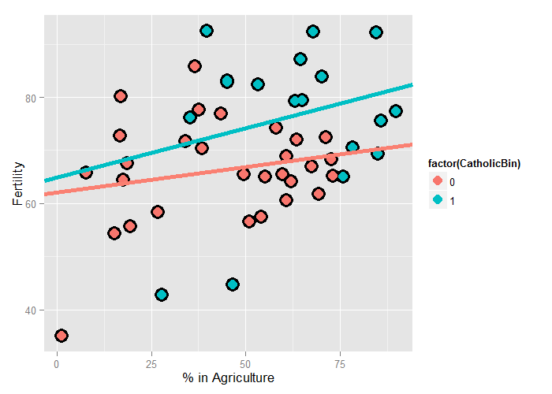

# Multivariable Regression Examples - Exercises


## Question 1

Do exercise 1 of the previous chapter if you haven't already. Load the dataset `Seatbelts` as part of the `datasets` package via `data(Seatbelts)`. Use `as.data.frame` to convert the object to a dataframe. Fit a linear model of driver deaths with `kms` and `PetrolPrice`as predictors. Interpret your results.


```r
library(datasets)
data(Seatbelts)
sb <- as.data.frame(Seatbelts)
fit <- lm(DriversKilled ~ kms + PetrolPrice, sb)
round(summary(fit)$coef, 4)
```

```
             Estimate Std. Error t value Pr(>|t|)
(Intercept)  215.7461    14.6656 14.7110   0.0000
kms           -0.0017     0.0006 -2.8469   0.0049
PetrolPrice -643.7895   148.2896 -4.3414   0.0000
```

```r
# Numbers need to be centered and maybe scaled
summary(sb$kms)
```

```
   Min. 1st Qu.  Median    Mean 3rd Qu.    Max. 
   7685   12680   14990   14990   17200   21630 
```

```r
summary(sb$PetrolPrice)
```

```
   Min. 1st Qu.  Median    Mean 3rd Qu.    Max. 
0.08118 0.09258 0.10450 0.10360 0.11410 0.13300 
```

```r
library(dplyr)
sb <- mutate(sb,
             pp=(PetrolPrice - mean(PetrolPrice)) / sd(PetrolPrice),
             mm=kms/1000,
             mmc=mm - mean(mm))
fit2 <- lm(DriversKilled ~ pp + mmc, sb)
round(summary(fit2)$coef, 4)
```

```
            Estimate Std. Error t value Pr(>|t|)
(Intercept) 122.8021     1.6629 73.8503   0.0000
pp           -7.8387     1.8055 -4.3414   0.0000
mmc          -1.7495     0.6145 -2.8469   0.0049
```

**ANSWER:** There are on average 123 drivers killed for the average gas price & distance driven. For every 1 standard deviation increase in gas price, we expect 7 to 8 fewer deaths when holding the distance traveled constant. For every 1000 km driven (holding gas prices constant) we expect 1 to 2 fewer deaths. All results are significant w/ 95% confidence.

---

## Question 2

Repeat question 1 for the outcome being the log of the count of driver deaths. Interpret your coefficients.

$$
\begin{eqnarray*}
log\left(Y_i\right) & = & \beta_0 + \beta_1 X_{1i} + \beta_2 X_{2i} + \epsilon_i \\
E\left[log\left(Y_i\right)\right] & = & \beta_0 + \beta_1 X_{1i} + \beta_2 X_{2i} \\
e^{E\left[log\left(Y_i\right)\right]} & = & e^{\beta_0} + e^{\beta_1 X_{1i}} + e^{\beta_2 X_{2i}}
\end{eqnarray*}
$$


```r
fit3 <- lm(I(log(DriversKilled)) ~ pp + mmc, sb)
1 - exp(summary(fit3)$coef[2,1])
```

```
[1] 0.06211298
```

```r
1 - exp(summary(fit3)$coef[3,1])
```

```
[1] 0.01391029
```

**ANSWER:** For every 1 standard deviation increase in gas price, we expect a 6% decrease in driver deaths when holding the distance traveled constant. For every 1000 km driven (holding gas prices constant) we expect a 1% decrease in deaths. All results are significant w/ 95% confidence.

---

## Question 3

Refer to question 1. Add the dummy variable `law` and interpret the results. Repeat this question with a factor variable that you create called `lawFactor` that takes the levels `No` and `Yes`. Change the reference level from `No` to `Yes`.


```r
fit4 <- lm(DriversKilled ~ pp + mmc + law, sb)
round(summary(fit4)$coef, 4)
```

```
            Estimate Std. Error t value Pr(>|t|)
(Intercept) 124.2263     1.8012 68.9674   0.0000
pp           -6.9199     1.8514 -3.7377   0.0002
mmc          -1.2233     0.6657 -1.8378   0.0677
law         -11.8892     6.0258 -1.9731   0.0500
```

```r
sb$lawFactor <- relevel(factor(sb$law, labels=c("No","Yes")), "Yes")
fit5 <- lm(DriversKilled ~ pp + mmc + lawFactor, sb)
round(summary(fit5)$coef, 4)
```

```
            Estimate Std. Error t value Pr(>|t|)
(Intercept) 112.3371     5.5547 20.2236   0.0000
pp           -6.9199     1.8514 -3.7377   0.0002
mmc          -1.2233     0.6657 -1.8378   0.0677
lawFactorNo  11.8892     6.0258  1.9731   0.0500
```

**ANSWER:** The law being in effect resulted in 11 to 12 fewer driver deaths on average, w/ 95% confidence, holding gas prices & distance driver as constant.

---

## Question 4

Discretize the `PetrolPrice` variable into four factor levels. Fit the linear model with this factor to see how R treats multiple level factor variables.

**ANSWER:** See R code below.


```r
sb$ppf <- as.factor((sb$pp <= -1.5) + (sb$pp <= 0) +
                        (sb$pp <= 1.5) + (sb$pp < Inf))
fit6 <- lm(DriversKilled ~ ppf + mmc + law, sb)
round(summary(fit6)$coef, 4)
```

```
            Estimate Std. Error t value Pr(>|t|)
(Intercept) 109.8405     9.5066 11.5541   0.0000
ppf2         10.8271     9.9462  1.0886   0.2778
ppf3         18.6904     9.9374  1.8808   0.0616
ppf4         25.0074    10.9163  2.2908   0.0231
mmc          -1.2991     0.7668 -1.6942   0.0919
law         -15.3445     6.0345 -2.5428   0.0118
```

---

## Question 5

Perform the plot requested at the end of the last chapter.


```r
require(ggplot2)
require(dplyr)
data(swiss)
swiss <- mutate(swiss, CatholicBin = 1 * (Catholic > 50))
fit <- lm(Fertility ~ Agriculture * factor(CatholicBin), swiss)
ggplot(swiss, aes(x=Agriculture, y=Fertility, color=factor(CatholicBin))) +
    geom_point(size=6, color="black") +
    geom_point(size=4) +
    xlab("% in Agriculture") +
    ylab("Fertility") +
    geom_abline(intercept=coef(fit)[1], slope=coef(fit)[2], size=2, 
                color="salmon") +
    geom_abline(intercept=coef(fit)[1] + coef(fit)[3],
                slope=coef(fit)[2] + coef(fit)[4], size=2,
                color=hcl(h=195, c=100, l=65))
```

<div class="rimage center"></div>
