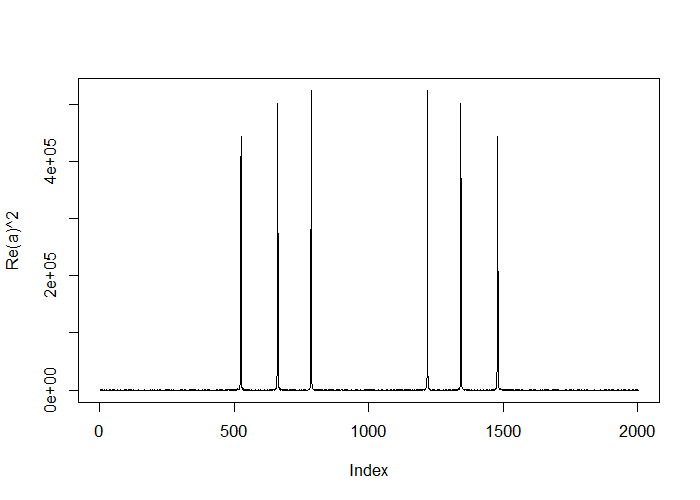

# Logistic Regression


## Key Ideas

- Frequently we care about outcomes that have two values
    - Alive/dead
    - Win/loss
    - Success/Failure
    - Etc
- Called binary, Bernoulli, or 0/1 outcomes
- Collection of exchangeable binary outcomes for the same covariate data are called binomial outcomes

---

## Example: Baltimore Ravens Win/Loss

#### Ravens Data


```r
# download.file("https://dl.dropboxusercontent.com/u/7710864/data/ravensData.rda", destfile="./data/ravensData.rda")
load("./data/ravensData.rda")
head(ravensData)
```

```
  ravenWinNum ravenWin ravenScore opponentScore
1           1        W         24             9
2           1        W         38            35
3           1        W         28            13
4           1        W         34            31
5           1        W         44            13
6           0        L         23            24
```

---

## Linear Regression

$$
RW_i = b_0 + b_1 RS_i + e_i
$$

$RW_i$ - 1 if a Ravens win, 0 if not

$RS_i$ - Number of points Ravens Scored

$b_0$ - Probability of a Ravens win if they scored 0 points

$b_1$ - Increase in probability of a Ravens win for each additional point

$e_i$ - Residual Variation

---

## Linear Regression in R


```r
lmRavens <- lm(ravensData$ravenWinNum ~ ravensData$ravenScore)
summary(lmRavens)$coef
```

```
                        Estimate  Std. Error  t value   Pr(>|t|)
(Intercept)           0.28503172 0.256643165 1.110615 0.28135043
ravensData$ravenScore 0.01589917 0.009058997 1.755069 0.09625261
```

---

## Odds

**Binary Outcome 0/1**

$$
RW_I
$$

**Probability (0,1)**

$$
\rm{Pr}(RW_i ~|~ RS_i,b_0,b_1)
$$

**Odds (0,$\infty$)**

$$
\frac{\rm{Pr}(RW_i ~|~ RS_i,b_0,b_1)}{1 - \rm{Pr}(RW_i ~|~ RS_i,b_0,b_1)}
$$

**Log Odds ($-\infty,\infty$)**

$$
\log\left(\frac{\rm{Pr}(RW_i ~|~ RS_i,b_0,b_1)}{1 - \rm{Pr}(RW_i ~|~ RS_i,b_0,b_1)}\right)
$$

---

## Linear vs Logistic Regression

**Linear**

$$
RW_i = b_0 + b_1 RS_i + e_i
$$

or

$$
E[RW_i ~|~ RS_i,b_0,b_1] = b_0 + b_1 RS_i
$$

**Logistic**

$$
\rm{Pr}(RW_i ~|~ RS_i,b_0,b_1) = \frac{e^{b_0 + b_1 RS_i}}{1 + e^{b_0 + b_1 RS_i}}
$$

or

$$
\log\left(\frac{\rm{Pr}(RW_i ~|~ RS_i,b_0,b_1)}{1 - \rm{Pr}(RW_i ~|~ RS_i,b_0,b_1}\right) = b_0 + b_1 RS_i
$$

---

## Interpreting Logistic Regression

$$
\log\left(\frac{\rm{Pr}(RW_i ~|~ RS_i,b_0,b_1)}{1 - \rm{Pr}(RW_i ~|~ RS_i,b_0,b_1)}\right) = b_0 | b_1 RS_i
$$

$b_0$ - Log odds of a Ravens win if they score zero points

$b_1$ - Log odds ratio of win probability for each point scored (compared to zero points)

$e^{b_1}$ - Odds ratio of win probability for each point scored (compared to zero points)

---

## Odds

- Imagine that you are playing a game where you flip a coin with success probability $p$
- If it comes up heads, you win $X$. If it comes up tails, you lose $Y$
- What should we set $X$ and $Y$ for the game to be fair?
$$
E[earnings] = Xp - Y(1 - p) = 0
$$
implies
$$
\frac{Y}{X} = \frac{p}{1 - p}
$$
- The odds can be said as "How much should you be willing to pay for a $p$ probability of winning a dollar?"
    - If $p > 0.5$ you have to pay more if you lose than you get if you win
    - If $p < 0.5$ you have to pay less if you lose than you get if you win

---

## Visualizing Fitting Logistic Regression Curves


```r
require(manipulate)
x <- seq(-10, 10, length=1000)
manipulate(
    plot(x, exp(beta0 + beta1 * x) / (1 + exp(beta0 + beta1 * x)),
         type="l", lwd=3, frame=F),
    beta1=slider(-2, 2, step=.1, initial=2),
    beta0=slider(-2, 2, step=.1, initial=0))
```

---

## Ravens Logistic Regression


```r
logRegRavens <- glm(ravensData$ravenWinNum ~ ravensData$ravenScore, family="binomial")
summary(logRegRavens)
```

```

Call:
glm(formula = ravensData$ravenWinNum ~ ravensData$ravenScore, 
    family = "binomial")

Deviance Residuals: 
    Min       1Q   Median       3Q      Max  
-1.7575  -1.0999   0.5305   0.8060   1.4947  

Coefficients:
                      Estimate Std. Error z value Pr(>|z|)
(Intercept)           -1.68001    1.55412  -1.081     0.28
ravensData$ravenScore  0.10658    0.06674   1.597     0.11

(Dispersion parameter for binomial family taken to be 1)

    Null deviance: 24.435  on 19  degrees of freedom
Residual deviance: 20.895  on 18  degrees of freedom
AIC: 24.895

Number of Fisher Scoring iterations: 5
```

---

## Ravens Fitted Values


```r
plot(ravensData$ravenScore, logRegRavens$fitted, pch=19, col="blue", 
     xlab="Score", ylab="Prob Ravens Win")
```

<div class="rimage center"></div>

---

## Odds ratios and confidence intervals


```r
exp(logRegRavens$coeff)
```

```
          (Intercept) ravensData$ravenScore 
            0.1863724             1.1124694 
```

```r
exp(confint(logRegRavens))
```

```
                            2.5 %   97.5 %
(Intercept)           0.005674966 3.106384
ravensData$ravenScore 0.996229662 1.303304
```

---

## ANOVA for Logistic Regression


```r
anova(logRegRavens, test="Chisq")
```

```
Analysis of Deviance Table

Model: binomial, link: logit

Response: ravensData$ravenWinNum

Terms added sequentially (first to last)

                      Df Deviance Resid. Df Resid. Dev Pr(>Chi)  
NULL                                     19     24.435           
ravensData$ravenScore  1   3.5398        18     20.895  0.05991 .
---
Signif. codes:  0 '***' 0.001 '**' 0.01 '*' 0.05 '.' 0.1 ' ' 1
```

---

## Interpreting Odds Ratios

- Not probabilities
- Odds ration of 1 = no difference in odds
- Log odds ratio of 0 = no difference in odds
- Odds ratio < 0.5 or > 2 commonly a "moderate effect"
- Relative risk $\frac{\rm{Pr}(RW_i ~|~ RS_i = 10)}{\rm{Pr}(RW_i ~|~ RS_i = 0)}$ often easier to interpret, harder to estimate
- For small probabilities RR $\approx$ OR but **they are not the same**!

[Wikipedia on Odds Raio](https://en.wikipedia.org/wiki/Odds_ratio)

---

## Further Resources

- [Wikipedia on Logistic Regression](https://en.wikipedia.org/wiki/Logistic_regression)
- [Logistic regression and glms in R](http://data.princeton.edu/R/glms.html)
- Brian Caffop's lecture notes on: [Simpson's paradox](http://ocw.jhsph.edu/courses/MethodsInBiostatisticsII/PDFs/lecture23.pdf), [Case-control studies](http://ocw.jhsph.edu/courses/MethodsInBiostatisticsII/PDFs/lecture24.pdf)
